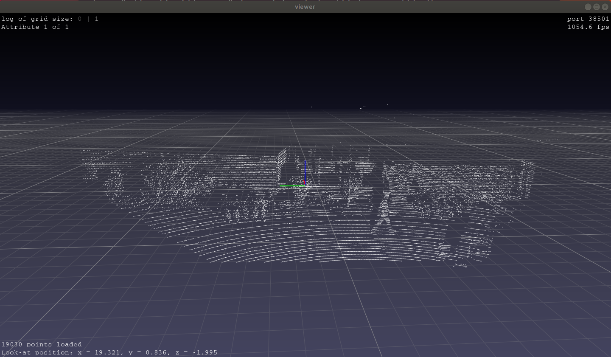
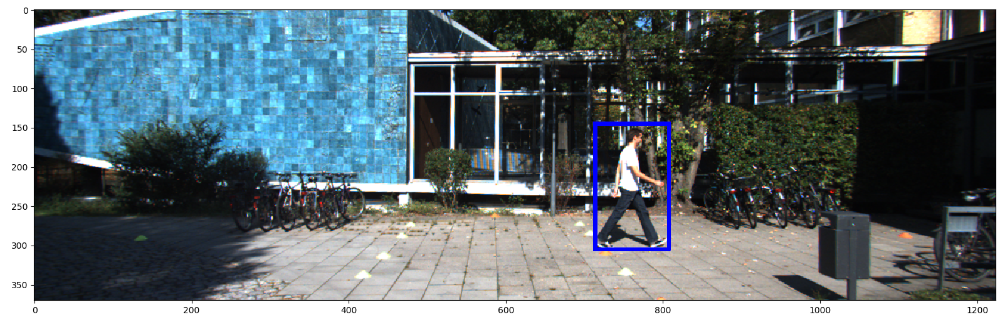

# dtc-KITTI-For-Beginners

[](https://opensource.org/licenses/MIT)
&nbsp;
[](https://www.codacy.com/app/dtczhl/dtc-KITTI-For-Beginners?utm_source=github.com&amp;utm_medium=referral&amp;utm_content=dtczhl/dtc-KITTI-For-Beginners&amp;utm_campaign=Badge_Grade)

Some explanations about KITTI dataset that might be helpful for beginners.

KITTI official website: <http://www.cvlibs.net/datasets/kitti/>

## Raw Data

KITTI include many different types of data, e.g., RGB cameras for images, Velodyne Laserscanner for point clouds, sensor data (e.g., GPS, acceleration). Details are given [here](http://www.cvlibs.net/datasets/kitti/raw_data.php).

For most of computer-vision works, the data of interest are
*   2D RGB images
*   Labels
*   3D point clouds  
*   Calibration files for synchronizing images and point clouds

### Illustration

Let's have a quick look at the 2D images and 3D point clouds. The download page is [3D Object Detection Evaluation 2017](http://www.cvlibs.net/datasets/kitti/eval_object.php?obj_benchmark=3d)
*   Left color images of object dataset (12 GB)
*   Velodyne point clouds (29 GB)

After uncompressing, we'll have two folders `data_object_image_2` and `data_object_velodyne`.

`data_object_image_2/training/image_2/000000.png` is shown below


We can use the [pptk](https://heremaps.github.io/pptk/tutorials/viewer/semantic3d.html) tool to show point clouds.
```shell
pip install pptk
```

A python script to show the point cloud ([python/point_cloud_viewer.py](python/point_cloud_viewer.py))
```shell
import numpy as np
import pptk


path_to_point_cloud = 'KITTI/data_object_velodyne/training/velodyne/000000.bin'

point_cloud_data = np.fromfile(path_to_point_cloud, '<f4')  # little-endian float32
point_cloud_data = np.reshape(point_cloud_data, (-1, 4))    # x, y, z, r
pptk.viewer(point_cloud_data[:, :3])
```

`data_object_velodyne/training/velodyne/000000.bin` is shown below (Can you see the person walking on street?)


**Note**: if you are using Ubuntu 18.04 and your program hangs without showing the viewer window, try fix it following <https://github.com/heremaps/pptk/issues/3>. Something like below if you are using Anaconda
```shell
cd $CONDA_PREFIX/lib/python3.7/site-packages/pptk/libs
mv libz.so.1 libz.so.1.old
sudo ln -s /lib/x86_64-linux-gnu/libz.so.1
```

## Cropping Point Clouds

The point clouds are scanned in 360 degrees while the RGB cameras are not (they have a much narrower field of view). In addition, KITTI only provides labels for objects that are within the images. Therefore, we usually need to remove points outside the image coordinates.

Download data from [here](http://www.cvlibs.net/datasets/kitti/eval_object.php?obj_benchmark=3d)
*   Left color images of object data (12 GB)
*   Velodyne point clouds (29 GB)
*   Camera calibration matrices of object data set (16 MB): synchronizing different data sources, e.g., camera, point clouds.

[python/crop_point_cloud.py](python/crop_point_cloud.py) is a script from this [github](https://github.com/qianguih/voxelnet/blob/master/data/crop.py) that can be used for this purpose. You only need to specify the paths to the training folders of images, point clouds, camera calibration, and the path you want to save the cropped point cloud.

```python
# path to data_object_image_2/training/image_2
IMG_ROOT = '/home/dtc/Data/KITTI/data_object_image_2/training/image_2/'
# path to data_object_velodyne/training/velodyne
PC_ROOT = '/home/dtc/Data/KITTI/data_object_velodyne/training/velodyne/'
# path to data_object_calib/training/calib
CALIB_ROOT = '/home/dtc/Data/KITTI/data_object_calib/training/calib/'
# path to the folder for saving cropped point clouds
SAVE_ROOT = '/home/dtc/Data/KITTI/save'
```

The cropped `000000.bin` point cloud is shown below, which only includes points within the image coordinates. In this example, the number of points is reduced from 115384 to 19030.



## Labels
KITTI provides labels (location of objects, etc.) for both 2D images and 3D point clouds. Download labels from [here](http://www.cvlibs.net/datasets/kitti/eval_object.php?obj_benchmark=3d)

*   training labels of object data set (5 MB)

An example `data_object_label_2/training/label_2/000000.txt`, meaning that there is a pedestrian in this data frame
```plain
Pedestrian 0.00 0 -0.20 712.40 143.00 810.73 307.92 1.89 0.48 1.20 1.84 1.47 8.41 0.01
```

The formats (could also refer [here](https://github.com/NVIDIA/DIGITS/blob/v4.0.0-rc.3/digits/extensions/data/objectDetection/README.md)): 15 columns.

1.  (column 0). There are 9 types of objects. The corresponding counts are tabulated below. See [python/label_info.py](python/label_info.py)

| Car   | DontCare | Pedestrian | Van   | Cyclist | Truck | Misc  | Tram  | Person_sitting |
| :---: | :---:    | :---:      | :---: | :---:   | :---: | :---: | :---: | :---:          |
| 28742 | 11295    | 4487       | 2914  | 1627    | 1094  | 973   | 511   | 222            |

2.  (column 1). Float from 0 (non-truncated) to 1 (truncated), where truncated refers to the object leaving image boundaries
3.  (column 2). Integer (0,1,2,3) indicating occlusion state: 0 = fully visible, 1 = partly occluded, 2 = largely occluded, 3 = unknown
4.  (column 3). Observation angle of object, ranging \[-pi..pi\]
5.  (column 4-7). 2D bounding box of object in the image (0-based index): contains left, top, right, bottom pixel coordinates
6.  (column 8-10). 3D object dimensions: height, width, length (in meters)
7.  (column 11-13). The center location x, y, z of the 3D object in camera coordinates (in meters)
8.  (column 14). Rotation ry around Y-axis in camera coordinates \[-pi..pi\]

### Labeled Objects in 2D Images
Let's add boxes around the objects in the images. The label information we need is column 0 (type of object), and column 4-7 (left, top, right, and bottom pixel coordinates in the image). `show_object_in_image()` in [python/object_viewer.py](python/object_viewer.py) can be used to draw objects in 2D images.

Need data if you haven't downloaded from [here](http://www.cvlibs.net/datasets/kitti/eval_object.php?obj_benchmark=3d).

*   Left color images of object data (12 GB)
*   Training labels of object data set (5 MB)

Showcase: `000000.png` only has one object of interest, which is boxed.



### Labeled Objects in 3D Point Cloud

To label 3D point clouds, we need label information of column 0 (type of object), columns 8-10 (height, width, and length), columns 11-13 (center location of x, y, z), and column 14 (rotation around axis y). However, these location information are given in RGB camera coordinate, and thus we need to project them into the point cloud coordinate.

We need data
*   Velodyne point clouds (29 GB)
*   Camera calibration matrices of object data set (16 MB)
*   Training labels of object data set (5 MB)

`show_object_in_point_cloud()` in [python/object_view.py](python/object_view.py) shows the labeled object in point clouds.

Showcase: `000000.bin`


## Point Cloud Data Format

KITTI point cloud is a (x, y, z, r) point cloud, where (x, y, z) is the 3D coordinates and r is the reflectance value. Each value is in 4-byte float. The raw data is in the form of \[x0 y0 z0 r0 x1 y1 z1 r1 ...\]. Below are the codes to read point cloud in python, c/c++, and matlab.

Python code
```python
import numpy as np

pc_data = np.fromfile(point_cloud_filename, '<f4')
pc_data = np.reshape(pc_data, (-1, 4))
```

C++ code
```c++
std::FILE *pFile = fopen(point_cloud_filename, "rb");
fseek(pFile, 0, SEEK_END);    // file pointer goes to the end of the file
long fileSize = ftell(pFile); // file size
rewind(pFile);                // rewind file pointer to the beginning
float *rawData = new float[fileSize];
fread(rawData, sizeof(float), fileSize/sizeof(float), pFile);
long number_of_points = fileSize / 4 / sizeof(float);
float **pc_data = new float*[number_of_points];
for (int i = 0; i < number_of_points; i++) {
  pc_data[i] = new float[4];
  for (int j = 0; j < 4; j++) {
    pc_data[i][j] = rawData[4*i+j];
  }
}
```

matlab code
```matlab
fileId = fopen(point_cloud_filename, 'r');
pc_data = fread(fileId, 'float');
pc_data = reshape(pc_data, 4, length(pc_data)/4);
```
