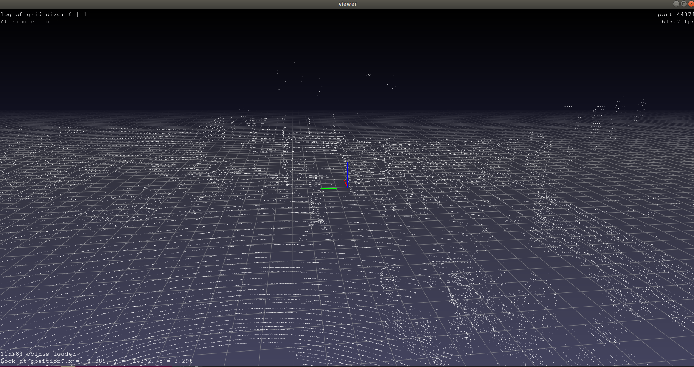

# dtc-KITTI-For-Beginners

Still working on....

[](https://opensource.org/licenses/MIT)
&nbsp;
[](https://www.codacy.com/app/dtczhl/dtc-KITTI-For-Beginners?utm_source=github.com&amp;utm_medium=referral&amp;utm_content=dtczhl/dtc-KITTI-For-Beginners&amp;utm_campaign=Badge_Grade)

Some explanations about KITTI dataset that might be helpful for beginners.

KITTI official website: <http://www.cvlibs.net/datasets/kitti/>

## Raw Data

KITTI include many different types of data, e.g., RGB cameras for images, Velodyne Laserscanner for point clouds, sensor data (e.g., GPS, acceleration). Details are given [here](http://www.cvlibs.net/datasets/kitti/raw_data.php).

For most of CV works, the data of interest are
*   2D RGB images
*   Labels
*   3D point clouds  
*   Calibration files for synchronizing images and point clouds

### Illustration

Let's have a quick look at the 2D images and 3D point clouds. The download page is [3D Object Detection Evaluation 2017](http://www.cvlibs.net/datasets/kitti/eval_object.php?obj_benchmark=3d)
*   Left color images of object dataset (12 GB)
*   Velodyne point clouds (29 GB)

After uncompressing, we'll have two folders `data_object_image_2` and `data_object_velodyne`.

`data_object_image_2/training/image_2/000000.png` is shown below


We can use the [pptk](https://heremaps.github.io/pptk/tutorials/viewer/semantic3d.html) tool to easily show point clouds.
```shell
  pip install pptk
```

A python script to show the point cloud (file: `python/point_cloud_viewer.py`)
```shell
  import numpy as np
  import pptk


  path_to_point_cloud = 'KITTI/data_object_velodyne/training/velodyne/000000.bin'

  point_cloud_data = np.fromfile(path_to_point_cloud, '<f4')  # little-endian float32
  point_cloud_data = np.reshape(point_cloud_data, (-1, 4))    # x, y, z, r
  pptk.viewer(point_cloud_data[:, :3])
```

`data_object_velodyne/training/velodyne/000000.bin` is shown below (Can you see the person walking on street?)



**Note**: if you are using Ubuntu 18.04 and your program hangs without the viewer window, try fix it following <https://github.com/heremaps/pptk/issues/3>. Something like below if you are using Anaconda
```shell
  cd $CONDA_PREFIX/lib/python3.7/site-packages/pptk/libs
  mv libz.so.1 libz.so.1.old
  sudo ln -s /lib/x86_64-linux-gnu/libz.so.1
```

## Cropping Point Clouds

The point clouds are scanned in 360 degrees while the RGB cameras are not (they have fixed and much smaller field of view). In additions, KITTI only provides labels for objects that are within the images. Therefore, we need to crop point clouds according to the images.

still working...
